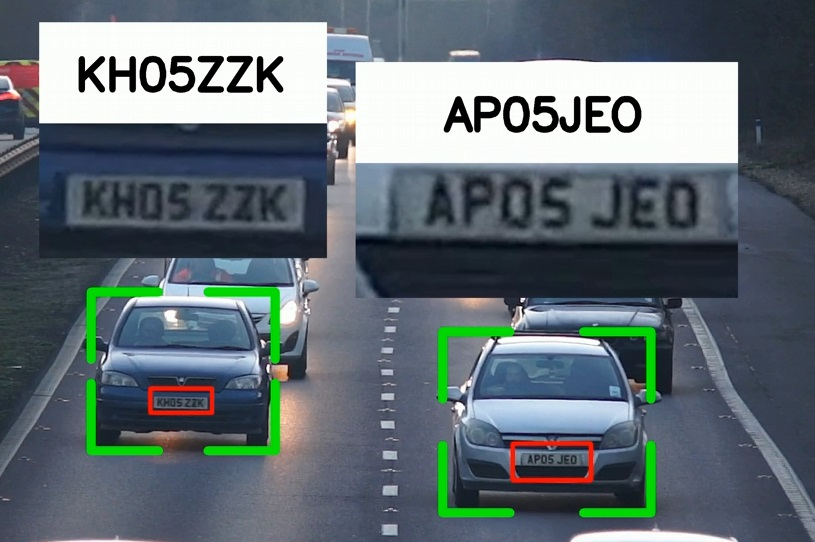

# License-Plate-Reading-In-Video-Using-YOLOv8

In this repository is implemmented the license plate  reading project by [Computer Vision Engineer](https://youtu.be/fyJB1t0o0ms?si=wuu3bamSpUVoOi60) in a Jupyter notebook. 

The project uses the following components:
- YOLOv8 nano to detect cars
- A custom license plate detector (based on YOLOv8) implemented in a previous [repository](https://github.com/GerardoRodriguezB/License-Plate-Detector-Using-YOLOv8)
- [EasyOCR](https://github.com/JaidedAI/EasyOCR) to read the license plates
- [SORT](https://github.com/abewley/sort) for tracking cars accross frames.




You can use the same Anaconda environment created in the plate detector [repository](https://github.com/GerardoRodriguezB/License-Plate-Detector-Using-YOLOv8). Install the requirements

```bash
pip install -r requirements.txt
```

If you have a GPU compatible with CUDA install

```bash
pip install torch==2.5.1 torchvision==0.20.1 torchaudio==2.5.1 --index-url https://download.pytorch.org/whl/cu118
```

otherwise install the versions for CPU

```bash
pip install torch==2.5.1 torchvision==0.20.1 torchaudio==2.5.1
```

The video used in the project can be downloaded [here](https://www.pexels.com/video/traffic-flow-in-the-highway-2103099/), name the file `cars.mp4` and put it in a folder named `video`. Name the file of your custom plate license detector as `plate_detector.pt` and put it in a folder named `model`. Finally, clone the SORT repository in the root of the project. 

At the end of the execution you will have the processed file `cars_processed.mp4` in the `video` folder. In this repository is included a fragment of the processed video.


